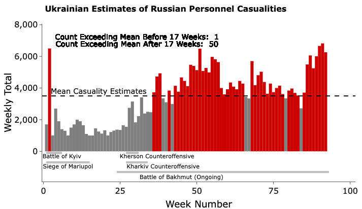
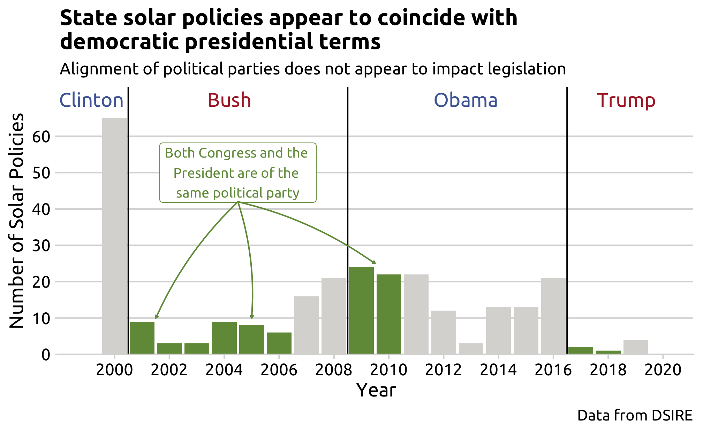

```{r setup, child="../setup.Rmd"}
```

---

class: center, middle

# [Ukraine After 21 Months](https://docs.google.com/presentation/d/1uQoWq_br8ZmEX5b9gdalkfDo2a211J3ahWqHVl9a-4U/edit#slide=id.p)

## by Bogdan Bunea, Ian Milko, Collin Schwab, and Rayyan Hussien

---

class: center, middle

# [Paying for Prestige: Analysis of University Rankings](https://www.youtube.com/watch?v=cuBKu9A3n6k)

## by Ayomide Ojo, Sahale Reese, Benyat Yimaj, and Youssouf Toure

---

class: center, middle

# [Cuban’s Migration](https://gwu.app.box.com/s/1ed9m9vctz6w2jk3hyl7fammbjsadg7w)

## by Sabina Pereira, Federica Negron, and Marena Marzari

---

class: center, middle

# [Characterizing Crimes in Los Angeles](https://vimeo.com/893969096?share=copy)

## by Dilrose Karakattil and Harshita Bharadwaj

---

class: center, middle

# [Parking Violations in Washington DC](https://docs.google.com/presentation/d/1NU1kmM9aBsZDtdUJC6ft5RyqHZ2V4fJ_JYibmlUQkoU/edit?usp=sharing)

## by Arsema Demeke, Kaitlyn Frost, Amna Maqsood, and Lola Nurullaeva

---

class: center, middle

# [From Past to Present: Analyzing Key Economic Metrics and the Shadows of Recessions](https://vimeo.com/893943196?share=copy)

## by Nishanth Nandakumar and Sai Kiran Reddy Vellanki

---

class: center, middle

# Market Pricing Strategies for Different Brands of Mobile Phones

## by Ji Qi (祁绩) and Zeyu Cheng (程泽宇)

---

class: center, middle

# Advancements in Solar and Wind Energy in the USA

## by Pingfan Hu and Abbey Kollar

---

class: center, middle

# [WMATA Ridership](https://www.youtube.com/watch?v=GUMsZ3wQa3Q)

## by Abdullah Alghamdi, Ziqian Yang, and Arman Naseh

---

class: center, middle

# The Trends, Spatial Difference, and Associated Outcome of Smoking

## by Kejia Hu and Jiaxin Wang

---

class: center, middle, inverse 

# 🎉 Awards Ceremony 🎉

---

class: center, middle 

# ✨ The Nominees for the **Shiny** Award are:

--

<br>

.cols3[

<center>

</center>

]

--

.cols3[

<center>

</center>

]

--

.cols3[

<center>

</center>

]

---

# ✨ The **Shiny** Award goes to...🥁

<br>

--

.leftcol[

# 🎉🎉🎉

### [From Past to Present: Analyzing Key Economic Metrics and the Shadows of Recessions](https://eda.seas.gwu.edu/showcase/2023-Fall/recessions.html)

### by Nishanth Nandakumar and Sai Kiran Reddy Vellanki

]

.rightcol[

<center>

</center>

]

---

# 🗑️ The Nominees for the **Janitor** award are:

--

.leftcol[

## [Ukraine After 21 Months](https://eda.seas.gwu.edu/showcase/2023-Fall/ukraine-war.html)

### by Bogdan Bunea, Ian Milko, Collin Schwab, and Rayyan Hussien

]

--

.rightcol[

## [From Past to Present: Analyzing Key Economic Metrics and the Shadows of Recessions](https://eda.seas.gwu.edu/showcase/2023-Fall/recessions.html)

### by Nishanth Nandakumar and Sai Kiran Reddy Vellanki

]

---

# 🗑️ The **Janitor** award goes to...🥁

<br>

--

# 🎉🎉🎉

# [Ukraine After 21 Months](https://eda.seas.gwu.edu/showcase/2023-Fall/ukraine-war.html)

## by Bogdan Bunea, Ian Milko, Collin Schwab, and Rayyan Hussien

---

class: center, middle, inverse

## Fill out course evals: https://gwu.smartevals.com/

### (please be specific!)

<center>

</center>
